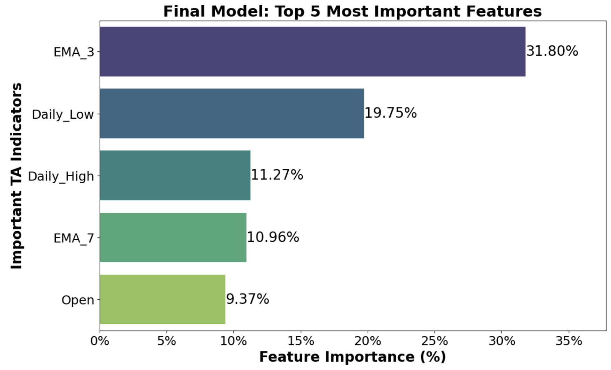

# Predict Future Stock Prices Using XGBoost and Technical Analysis
## Business Understanding
This project uses XGBoost, a supervised machine learning model, to predict the daily closing price of a stock one week (5 trading days) in the future. The goal is to create a prediction model that consistently results in average yearly returns matching or beating the average yearly return of the S&P500. Using financial tools commonly used by investment professionals to aid in decision making, we gather these tools into one model to train it to predict daily closing price of a stock in 1 week. If successful, this tool would yield a massive edge to anyone who has it, would provide profitable returns on trades, and would be easy to tune or add other features, for when market conditions change.

## Data Understanding
The features used to train the model are daily price data and technical analysis (TA) indicators. 10 years of Daily price data from 2015 to 2025 was pulled from Yahoo Finance and includes daily open price, daily high price, daily low price, daily volume, and daily close price (our target variable). TA indicators are used frequently as part of an intra-day or swing trader strategy. Some examples of TA indicators are exponential moving averages, bollinger bands, and stochastic oscillators. 

## Data Preparation
These indicators are calculated using the daily price action data and can provide information about the price action of a stock, such as strength, momentum, and support/resistance. Not only were daily values calculated for each TA indicator, but 3-day, 5-day, and 7-day moving averages were calculated for each indicator as well. Before modeling and after calculating the features and moving averages, lags were added to the top 35 highest contributing feature. 1-day, 2-day, 3-day, 4-day, and 5-day lags were added in order to give the model information on what the value of these features were the past 5 trading days. Once the data was cleaned and processed, the top 60 most contributing features were calculated and any features outside of the top 60 was dropped. This helped in reducing noise and computational power. 

## Modeling
The model we will be using to predict price is XGBoost. XGBoost is a commonly used ML algorithm for time series analysis. It's based on gradient boosting, optimized for speed, and is great for large datasets and unscaled data. With the 10 years of historical data we had, the data from January 2025 to January 2023 was used to train the model, and the data after January 2023 up to March 2025 was used to test the model. After creating a baseline model, 5 other models creating by tuning the hyperparameters colsample_bytree, max_depth, and learning_rate. Out of the 6 total models created, the model with the most desirable metrics was chosen. 

## Evaluation
In the modeling phase, the metrics used to evaluate the model were Mean Absolute Error, Mean Absolute Percent Error, Median Absolute Error and R-Squared. Other calculated metrics included Mean Squared Error and Root Mean Squared Error. Model evaluation focused on absolute metrics, rather than squared metrics, for the purposes of interpretation. Since the model was focused on getting it's predicted values as close as possible to the actual values, absolute metrics made more sense in this context. Prioritizing squared metrics makes sense if you are trying to minimize large outlier errors. In our scenario, squared metrics were only taken into consideration if the absolute metrics of two models were very similar. After choosing the best performing model, the model was run through a trading simulation in order to test the predicted values it generated from January 2023 to March 2025. Overall, the trading simulation of our model resulted in a loss. Although the win ratio at 36% was promising, the Sharpe ratio was -0.29%, incidating that the investment returns were not worth the risk. On top of this, the yearly returns using our model was around -1.16%. 

## Deployment
Because this model is currentl unprofitable, it will not be immediately put into deployment. However, many actions can be taken in order to create a model which is profitable. Using features other than TA indicators, such as economic data, sentiment analysis, and fundamental analysis, may result in a stronger model. On top of this, we can create models based on the philosophies of popular investors, such as warren buffet and Mark Minervini, as well as model specific trading strategies. Once we gather data on the features that result in the highest profitability and combine that with the strategies of well known investors, we can create our own unique prediction model. Another option we have is instead of creating a model to predict exact price, we can create a classification model to predict movement instead i.e. predict if a stock will go up or down. This simpler approach may result in higher accuracy and once we prove that works, we can continue to optimize it and create more classes based on how much the price is predicted to increase or decrease. Using the model that we create, we can also monitor its errors overtime and create a hedging strategy based on those errors, in order to limit downside risk. 

## Visualizations
    1. 
        *Top 5 financial valuation features used by the model and their percentage contribution.*

  ## Links
  -  [Google Slides Presentation](https://docs.google.com/presentation/d/1_FdawOPQgTHqiRTw8pNXzseSlssfzFe4NdpMt1__LvY/edit?usp=sharing)
  - [NASDAQ Stock Screener](https://www.nasdaq.com/market-activity/stocks/screener)
    

## Repository Navigation
- [Business Understanding](#business-understanding)
- [Data Understanding](#data-understanding)
- [Data Preparation](#data-preparation)
- [Modeling](#modeling)
- [Evaluation](#evaluation)
- [Visualizations](#visualizations)
- [Links](#links)
- [Notebook](notebook/capstone_project.ipynb)
- [Presentation](presentation.pdf)
- [Visuals](visuals/)
- [Data](data/)